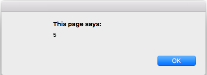
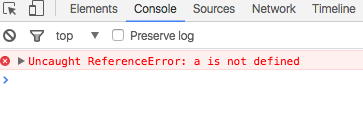

## Variabel
Variabel adalah *penampung / container* dari suatu nilai.
Nilai ini dapat bertype number, string, boolean, atau yang lainnya.

Contoh :
```javascript
var a = 5; // variabel 'a' dengan nilai '5' yang bertipe number
var b = 'Hello world!'; // variabel 'b' dengan nilai 'hello world' bertype string
```

> Di javascript hanya di kenal type data Number tidak ada type integer atau float maupun double.
Number di javascript selalu berjenis float 64bit

### Hoisting
Hoisting adalah tingkah laku seolah - olah javascript memindahkan sebuah deklarasi dan function ke atas.

contoh :

```javascript
// Seolah - olah fungsi panggil dan deklarasi variabel di pindahkan ke atas, seperti ini :

// function panggil() {
//   console.log('hello world!');
// }
// var a;

panggil(); // outputnya : 'hello world'
console.log(a); //outputnya undefined

var a = 'Test Variabel';

function panggil() {
  console.log('hello world!');
}
```

Sebenarnya yang terjadi, karna proses compile javascript melalui 2 tahap, yaitu :

1. Tahap creation : pada tahap ini function dan deklarasi variabel akan di alokasikan ke memori.

2. Tahap eksekusi : pada tahap ini karna deklarasi variabel dan function telah di alokasikan ke memori maka ini akan di eksekusi terlebih dahulu. Ini seolah - olah memindahkan function dan deklarasi variabel ke atas.

Proses inilah yang dinamakan **hoisting**.

> Untuk variabel yang akan di alokasikan ke memori hanya deklarasi bukan inisialisasi.

```javascript
//seolah - olah 'var a' dipindahkan ke atas

//var a

 a = 'Test Variabel'; // inisialisasi

console.log(a); //outputnya 'Test Variabel'

var a; // deklarasi
```

## Scope
Scope, kita sudah sangat sering jumpai jika kita telah mengenal bahasa pemrograman lain sebelumnya, seperti PHP, Python, Ruby, Java, dll.
Tapi mungkin masih banyak dari anda yang bertanya apa itu scope?
Scope adalah ruang lingkup dari kode program. Jadi ini adalah batasan - batasan pengaksesan sebuah kode program.

> Scope mengacu kepada ruang lingkup variabel.

Scope terbagi dalam 3 bagian :

### 1. Block Scope
Block scope adalah ruang lingkup kode program yang terbatas hanya dalam sebuah block code yang biasanya berada di dalam if statements, looping (for, while, dll), try-catch, dll. Yang ditandai dengan {} (kurung kurawal) sebagai pembuka dan penutup kode program tersebut.
Namun javascript tidak mengenal block scope, *javascript hanya mengenal function scope dan global scope*.


```javascript
if(true) {
  var a = 5 // Kita menginisialisai variabel a dengan nilai 5
}

alert(a); // jika dipanggil di luar block scope if, apa yang terjadi?
```
Yang terjadi :



Inilah bukti jika block scope tidak berlaku di javascript, karna kita bisa mengakses variabel yang berada di dalam block scope if.

>Terkecuali untuk try-catch sejak es3 memang di rancang untuk memiliki block scope

```javascript

try {
  throw 'error';
}
catch(e) {

}

console.log(e); // jika di panggil diluar block scope try-catch, apa yang terjadi?
```

Yang terjadi :


Jika kita perhatikan pada contoh if, kita dapat mengakses sebuah apapun yang berada di dalam block scope if (dalam contoh mengkases variabel). Sedangkan pada try-catch ketika kita ingin mengakses 'e', yang muncul adalah error.
Ini menandakan bahwa di javascript khusus untuk try-catch memiliki block scope.

### 2. Function Scope
Dari namanya saja kita bisa menebak bahwa function scope adalah kode program yang terbatas hanya dalam sebuah function. Artinya, apapun yang berada di dalam sebuah fungsi tidak akan bisa di akses dari luar fungsi tersebut.

```javascript
function panggil() {
  var a = 'coba'; // var a berada di dalam function scope
}

panggil();
console.log(a); // apa yang terjadi, ketika kita ingin mengakses variabel a yang berada di dalam function scope panggil?
```

yang terjadi :



Ini berarti bahwa javascript memiliki function scope.

Selain itu di dalam function, jika kita ingin mengakses sebuah variabel, jika variabel itu tidak berada di dalam satu function scope yang sama maka akan dicari sampai ke global scope, contohnya :

```javascript
var a = 'coba global'

function panggil() {
  var a = 'coba 1';
  function panggil2() {
    var a = 'coba 2';
    console.log(a);
  }
  panggil2();
}

panggil(); // outpunya adalah 'coba 2'
```

```javascript
var a = 'coba global'

function panggil() {
  var a = 'coba 1';
  function panggil2() {
    // var a = 'coba 2';
    console.log(a);
  }
  panggil2();
}

panggil(); // outpunya adalah 'coba 1'
```

```javascript
var a = 'coba global'

function panggil() {
  // var a = 'coba 1';
  function panggil2() {
    // var a = 'coba 2';
    console.log(a);
  }
  panggil2();
}

panggil(); // outpunya adalah 'coba global'
```

```javascript
// var a = 'coba global'

function panggil() {
  // var a = 'coba 1';
  function panggil2() {
    // var a = 'coba 2';
    console.log(a);
  }
  panggil2();
}

panggil(); // outpunya adalah 'reference error'
```


### 3. Global Scope
Global scope adalah kode program terluar, dalam artian tidak di dalam function scope maupun block scope.

variable global akan mengacu pada window object :

```javascript
var a= 'Hello world';

console.log(a); // outputnya 'Hello world'
console.log(widnow.a); // outputnya juga sama 'Hello world'
```

jika di dalam sebuah function scope terdapat sebuah variabel tanpa 'var' dan tidak dalm mode strict, maka di anggap sebagai global variabel (variabel yang terdapat di global scope), contohnya ""

```javascript
function panggil() {
  a = 'Hello world';
}

panggil();
console.log(a); // outputnya 'Hello world'
```
